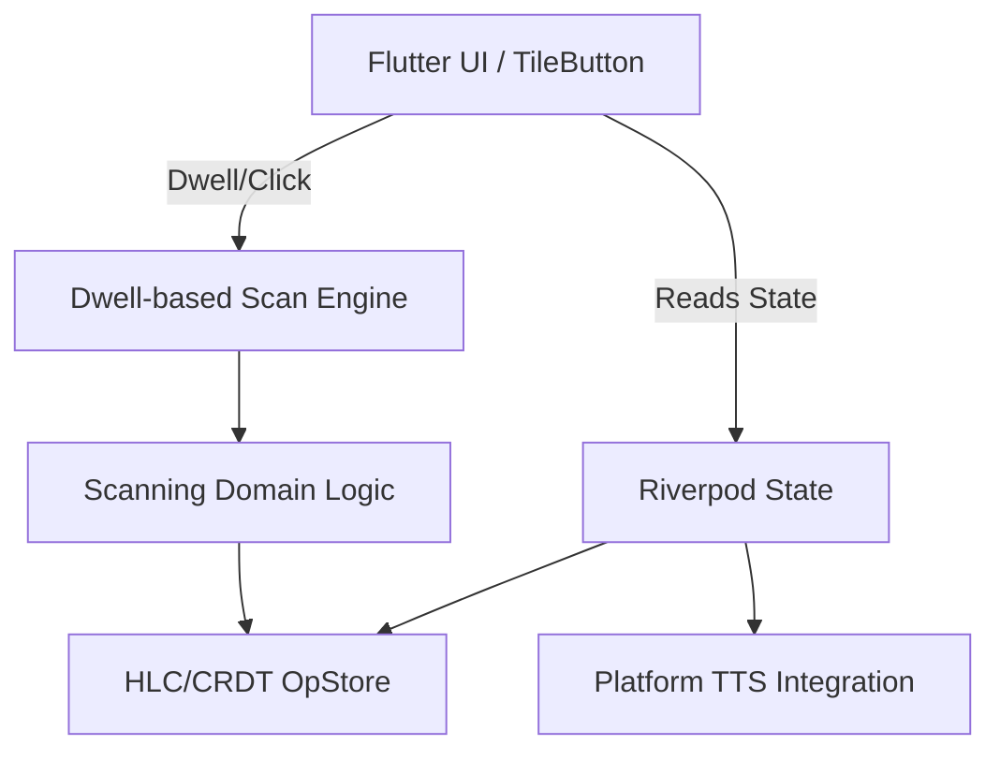

# Tesservox | Privacy-First AAC Platform

**Version:** 2.0.0

Tesservox is an offline-first, highly testable Augmentative and Alternative Communication (AAC) platform built in Flutter. It is designed around deterministic accessibility engines, ensuring communication remains robust, private, and independent of internet connectivity.

## Core Philosophy

1. **Privacy-first:** Tesservox contains no analytics or telemetry and stores usage data locally. Vocabulary processing stays on-device; speech uses the device's configured TTS engine.
2. **Determinism:** The scanning engine operates independently of UI jank, ensuring selections map monotonically to user intent.
3. **Accessibility First:** Custom physics-based dwell selection (bypassing the need for physical clicks) integrated directly into the semantic tree.

## Architecture

Tesservox uses a layered Flutter architecture with isolated domain logic, Riverpod state management, and deterministic, testable accessibility engines. 



## What Works Today

- ✅ **Dwell-Based Selection:** A physics-based hover-timer that allows users to select tiles without clicking.
- ✅ **Platform-TTS Integration:** Uses standard OS-level text-to-speech for generating spoken output across multiple locales.
- ✅ **Offline Vocabulary:** Vocabulary packs and state are strictly local, integrity-tested with pack hashes.
- ✅ **Deterministic Scanning:** A purely logical scanning engine separated completely from Flutter's rendering loop.
- ✅ **Test Infrastructure:** Comprehensive CI, CodeQL scanning, and PR-agent configurations are integrated into the repository.

### Known Limitations (Architectural Prototype)

Tesservox is currently configured as a functional architectural prototype:
- **Placeholder Symbols:** The current UI uses standard Unicode emoji. These are *architectural placeholders* and are not formally licensed AAC symbols.
- **Platform TTS Dependency:** While the vocabulary is fully offline, speech generation currently relies on the host device's built-in platform TTS engines.
- **Dwell vs. Gaze:** Selection is currently pointer-dwell based. Native camera-based gaze tracking is planned for future releases.

## Installation

```bash
# Clone the repository
git clone https://github.com/DARREN-2000/Tesservox.git
cd Tesservox

# Install dependencies
flutter pub get

# Run the test suite
flutter test

# Run the app
flutter run
```

## Testing & Quality

The testing suite explicitly verifies:
- Monotonic HLC timestamps
- Convergence under shuffled operations
- Idempotent scanning state transitions
- Debounce behavior & accessibility semantics
- Vocabulary-pack integrity

Run the full CI suite locally:
```bash
flutter analyze
flutter test
flutter build web
```

## License

This project is licensed under the MIT License. See the `LICENSE` file for details. 
*Note: The placeholder assets and emoji currently used are subject to standard Unicode licensing and are intended only for prototype demonstration.*
