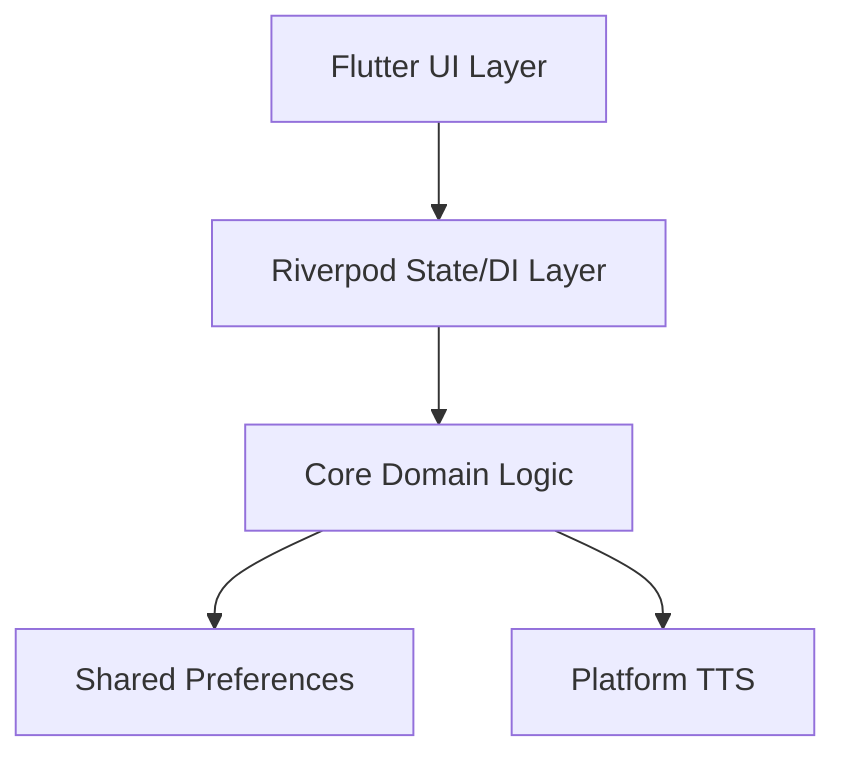

# 💠 Tesservox

[](https://github.com/DARREN-2000/tesservox/actions/workflows/ci.yaml)
[](https://github.com/DARREN-2000/tesservox/actions/workflows/pages.yml)
[](https://opensource.org/licenses/MIT)
[](https://github.com/DARREN-2000/tesservox/releases)

> The ultimate, secure, offline-first AAC platform for unparalleled speech independence.


**Tesservox** (formerly vaani) is a free, offline, multilingual AAC (augmentative and alternative communication) system designed for individuals who cannot speak. It runs on minimal hardware, requires no cloud synchronization, and respects user privacy by keeping all operations local.

## ✨ Key Features

- **Offline-First:** Does not require an internet connection, ever.
- **Privacy Guaranteed:** No accounts, no data telemetry.
- **Cross-Platform:** Builds effortlessly on Android, Web, and Desktop.
- **Accessible Interface:** Optimized for diverse motor needs.

## 🚀 Quick Start

Ensure you have [Flutter](https://flutter.dev/) installed, then get up and running instantly:

```bash
# Get dependencies
flutter pub get

# Run the app locally
make run
```

## 🏗 Architecture

Tesservox strictly adheres to a domain-driven architectural pattern utilizing Riverpod for pure-Dart dependency injection, ensuring the application stays fast and maintainable.



## 🐋 Dockerization

We use a highly optimized multi-stage build.

| Command | Action |
| :--- | :--- |
| `make docker-build` | Builds the Tesservox Docker image |
| `docker-compose up` | Runs the services via Docker Compose |

## 🤝 Governance & Community

Tesservox operates under strict open-source governance. Please review:
- [Code of Conduct](./CODE_OF_CONDUCT.md)
- [Security Policy](./SECURITY.md)
- [Contributing Guidelines](./CONTRIBUTING.md)
- [Maintainers](./MAINTAINERS.md)
